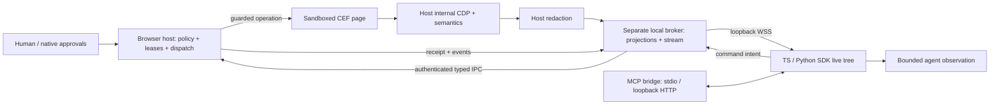

# System architecture

Status: accepted direction from the approved roadmap, 2026-10-01. Runtime contracts are unimplemented. Detailed policy and schema decisions remain with their assigned tasks.

## Scope and engine

Use pinned upstream CEF distributions with supported Chromium runtime and sandbox, C++/CEF Views GUI, and no Chromium fork. Task 003 selects and records the exact Windows pin, distribution checksum and build inputs. Floating dependencies or disabling the sandbox fail the gate.

Windows 11 x64 first; macOS 14+ arm64 and Ubuntu 24.04 x64 (X11 and Wayland) must pass parity before 1.0. No hosted control plane, public listener, remote fleet, full Chrome extension parity or cloud account sync. External agent hosts own model calls and credentials. Human browsing needs no LLM subscription. Unsupported canvas, challenges, DRM and authentication flows report coverage and hand control to the human.

## Process ownership

| Process | Owns | Forbidden authority |
|---|---|---|
| Browser host: apps/browser | Native GUI, profiles, tab/document identity, permission authority, leases, guarded execution, internal engine adapter, redaction and approved OS file/secret resolution | Model calls; permission grants derived from page text, broker validation or tool annotations |
| CEF renderer/upstream helpers | Sandboxed website execution/rendering and upstream engine work | Application filesystem/shell/credential-store privileges, broker/native APIs, public CDP |
| Separate C++ local broker: apps/broker | Paired WSS clients, message validation, per-client sessions/projections, subscriptions, bounded caches, replay/events and delivery queues | Final permission grants, direct secret/file resolution, unchecked browser mutation |
| TypeScript MCP bridge | Five tools, MCP transport/version adaptation, mapping calls to native WSS | Scope elevation, invented receipts, public JS/CDP, credentials in model context |
| TypeScript/Python SDK clients | Live-tree reduction/acknowledgment, reconnect, typed outcomes and bounded model observations | Approvals or automatic replay of uncertain effects |

The GUI and engine stay in the host; the broker runs as a separate C++ executable built with CMake. The coordinator accepted that task-001 implementation contract because it shares the native toolchain across three OS targets and avoids a second runtime in native packaging. Broker code has no CEF Views/renderer dependency or GUI privilege. Task 002 scaffolds this established language/build direction; protocol libraries and cryptographic/wire details stay with tasks 006/008/021. Platform helpers do not bypass host policy.

## Trust boundaries

| Boundary | Required enforcement |
|---|---|
| Website → host | Page text, names, URLs, DOM and accessibility are untrusted data. Host security/engine grant no application privilege from content; upstream sandbox stays enabled. |
| Local client → broker | Paired credential/certificate identity on loopback WSS; reject unpaired clients and browser-origin connections; validate shape and resource bounds. |
| Broker → host | Narrow authenticated typed IPC; host checks sender, destination, scope, target, actionability and lease immediately before dispatch. Broker cannot grant authority. |
| Host → published state | Redact before broker publication, recording, errors and diagnostics. Frame origins retain independent grants. |
| Human → agent | Native input revokes affected leases and cancels undispatched work; no two agents mutate one tab. Native UI alone approves sensitive actions. |
| Release → installation | Authenticated artifacts and sandbox preservation; signing/rotation/recovery decisions belong to task 076. |

Task 006 defines attacker/capability policy, pairing/certificate/IPC mechanisms, revocation races and negative vectors. This document fixes enforcement locations, not cryptographic choices.

## Data and control flow

1. Native pairing grants explicit profile/tab/origin/operation scope; connect defaults to isolated agent profile and observe mode. Credentials stay outside model context.
2. Host combines accessibility and constrained DOM enrichment, assigns opaque identity and redacts before broker handoff. Backend DOM identifiers are never public references.
3. Broker sends projection snapshots and ordered atomic deltas. SDK applies and acknowledges them; DOM mutations alone never trigger model calls.
4. Commands carry session/request/tab/observation identity. Host revalidates authority, document, target, actionability, origin/redirect policy and lease at dispatch, then emits an honest receipt.
5. Gaps/incompatible history require resynchronization. Human input/disconnect release control; already-dispatched website effects cannot be automatically undone.

## State and execution invariants

JSON encodes a minimal semantic tree. Snapshot identity separates tab, document epoch, projection and revision. Nodes include opaque ref, frame identity/origin, role/name, ordered children, supported actions and applicable text/value/state. Deltas contain base_revision, revision, complete upserts and removals, applied atomically. Observations have an opaque observation_id, token accounting, coverage and continuation information.

Navigation/frame/node replacement invalidates affected references; unrelated mutations do not invalidate every target. Pagination is revision-bound. Inaccessible frames, virtualized content, unsupported controls, redaction and truncation are explicit coverage; missing coverage never means an empty page. Cross-origin frames require their own grants.

Default model-facing budget is 4,096 configured-tokenizer tokens, public range 512–16,384. Compression saves bandwidth; filtering/deltas/context selection save tokens. Task 021 owns exact snapshot/delta/reset/ack/resume schemas, retained-state rules and identity algorithms. No TTL, hash algorithm or replay size is selected here.

Identical live-session request-ID retries recover recorded receipts; changed-payload reuse fails. Outcomes: completed/rejected/failed/unknown. Dispatch: not_sent/sent/unknown. Browser completion does not certify a business transaction. Crash-after-dispatch uncertainty stays unknown: no automatic replay or exactly-once promise. Host owns authoritative execution receipts; broker retains redacted copies.

## Handoff and acceptance

[Module map](module-map.json) assigns one primary owner to every task, plus collaborators. Reserved paths guide task 002; they do not call for placeholder implementations. Task 031 makes schemas/ the canonical implementation source for bridge/SDK contracts.

| Gates | Required evidence |
|---|---|
| M01–M03 | Contracts, clean Windows build, exact routing records, sandbox/authorization negative tests, usable human browsing/takeover |
| M04–M08 | Semantic coverage, convergence/recovery, dispatch races, schemas, both SDKs/MCP and signed Windows alpha |
| M09–M12 | Profile/file/secret isolation, DevTools coexistence, usable UI and published compatibility |
| M13–M16 | Frozen-corpus efficiency, independent security review, all three OS contracts and authenticated updates/recovery |
| M17–M18 | 24-hour soak per OS, measured latency, five real beta testers, same signed candidate across gates and post-publication smoke test |

All 18 original gates and per-task criteria remain required. The 70% token reduction versus raw DOM, 25% versus compact accessibility baseline, 95% supported-workflow completion, at most two-point baseline regression and reference p95 state delivery ≤100 ms are unmeasured targets. Runtime resource limits must be recorded by their owner tasks.

CEF internal DevTools, human DevTools coexistence, sandbox packaging and platform behavior require pinned-build tests (003/007/016/046/071/072). Upstream pointers from the approved plan: [general usage](https://chromiumembedded.github.io/cef/general_usage), [browser API](https://github.com/chromiumembedded/cef/blob/master/include/cef_browser.h), [sandbox setup](https://github.com/chromiumembedded/cef/blob/master/docs/sandbox_setup.md). These are references, not fresh verification claims.
